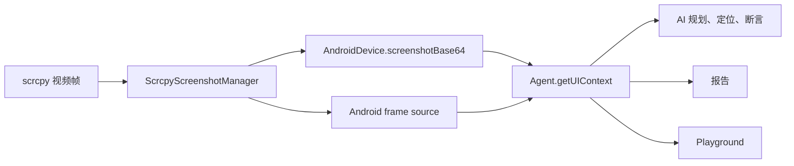

# Android scrcpy 画面滞后：影响范围、方案选择与实现

## 结论

这不是只影响报告和 Playground 展示的问题。

发生滞后时，Android 真实界面和已经发出的 ADB 指令通常是正确的，但
Midscene 的截图、AI 定位、规划、断言、报告和 Playground 都会读取同一条
scrcpy 视频链路。报告和 Playground 只是最容易观察到旧帧的两个入口；如果
继续执行后续 AI 步骤，AI 也可能基于动作前的旧画面做出错误判断。

本次选择在 scrcpy 帧进入 Midscene 时建立统一的 freshness gate：根据视频帧
PTS 检测传输队列是否已经落后，拒绝过期帧，并让截图请求使用现有 ADB
screencap 回退。这样不依赖某一种交互动作，也不需要通过固定等待猜测队列何时
追平。

实现 PR：[web-infra-dev/midscene#2923](https://github.com/web-infra-dev/midscene/pull/2923)

## 问题边界

### 什么是正确的

- ADB `tap`、`swipe`、输入等命令会在预期时间发送到设备。
- 设备收到命令后，真实 Android 界面会正常跳转。
- 如果一次点击是根据尚未滞后的画面计算出的坐标，这一次点击通常会正确落点。

### 什么可能是错误的

- 动作后的截图可能仍来自动作前已经进入 scrcpy 传输队列的旧帧。
- 后续 `aiTap`、`aiAssert`、查询、规划等步骤可能继续看到旧页面。
- 如果执行开始时视频链路已经落后，第一次 AI 定位和点击也不能保证正确。
- 报告截图和 Playground 预览会显示同样的旧页面。

核心调用关系如下：



因此，“真实设备界面正确”与“AI 看到的界面正确”是两个不同结论。前者由 ADB
动作链路决定，后者由截图链路决定。

## 根因

scrcpy 按编码顺序发送视频 packet。远程 ADB 隧道吞吐不足或短时拥塞时，设备
继续生产新帧，主机则按顺序消费传输队列中的旧帧。即使设备已经完成页面跳转，
主机下一次读到的 packet 仍可能是在动作前生成的。

这也解释了两个已确认现象：

1. 增加固定等待不能保证解决。队列可能需要更久才能追平，也可能在等待期间继续
   增长。
2. 不能用 packet 的主机到达时间判断动作前后。动作前生成的旧帧可以在动作后才
   到达主机。

## 真实设备复现

在远程 OPPO PGBM10 上，ADB 已经把页面从“设置”切换到 ColorOS 更新页，但
scrcpy 在动作后约 0.5 秒、1 秒和 3 秒采集到的仍是旧的“设置”页面，约 5 秒后
才追上真实界面。观测到相对传输滞后最高增长到约 2754 毫秒。

这次复现没有人为降低带宽或增加 sleep，说明问题可以由真实远程链路自然触发，
不是测试注入造成的假象。

## 候选方案与选择

| 方案 | 能否保证 freshness | 影响范围 | 主要问题 | 结论 |
| --- | --- | --- | --- | --- |
| 动作后固定等待 | 不能 | 所有调用方都可添加 | 不知道队列深度；增加耗时后仍可能读到旧帧 | 不采用 |
| 按 packet 主机到达时间做动作屏障 | 不能 | 指定动作 | 旧帧可以在动作后到达，时间归类错误 | 不采用 |
| 每次 tap / doubleTap 前重启 scrcpy | 对这些动作有效 | 仅已接入的动作 | 连接抖动；遗漏滚动、输入、系统动作和应用自主变化 | 不作为主方案 |
| 降低码率、FPS 或分辨率 | 不能 | 整条流 | 只能降低积压概率，不能建立正确性边界 | 可作为性能优化 |
| 根据 PTS 检测积压并统一拒绝旧帧 | 能阻止已检测到的旧帧进入消费端 | 截图、AI、报告、Playground | 滞后时会触发 ADB 截图回退，有额外开销 | 本次采用 |

关闭流再执行 tap 的方案能解决最初 case，但它把正确性绑定到了几个动作入口。
真正需要保证的是“任何消费者都不能拿到已知过期的帧”，所以 freshness 应该在
帧源边界统一处理。

## 最终方案

### 1. 用相对 PTS 偏移检测传输积压

scrcpy packet PTS 与主机 `process.hrtime.bigint()` 都是单调时钟，但两者的
绝对起点不同。对连接中的第 `i` 个帧计算：

```text
arrivalOffset[i] = hostReceivedAt[i] - packetPts[i]
baseline          = min(arrivalOffset[0..i])
transportLag[i]   = arrivalOffset[i] - baseline
```

绝对时钟差会被同一连接中的基线抵消，`transportLag` 的增长表示 packet 在设备
编码完成后又增加了多少排队时间。

当前阈值是 500 毫秒：

- `transportLag <= 500ms`：接受该帧。
- `transportLag > 500ms`：丢弃该帧、清除缓存 keyframe，并记录明确错误。
- 传输追平后：自动清除错误并恢复接受 scrcpy 帧。

如果 PTS 向后跳变，说明媒体时间线发生重置；实现会清空旧基线并重新校准。scrcpy
断开时也会清空全部 freshness 状态，避免跨连接比较不同时间线。

### 2. 截图拒绝退回 scrcpy 旧缓存

过去等待新 keyframe 超时后，`getScreenshotJpeg()` 可以返回缓存帧。现在如果
manager 已经检测到传输滞后，它会抛出带滞后毫秒数的错误，不再用旧缓存伪装成
当前截图。

`AndroidDevice.screenshotBase64()` 已有 scrcpy 失败后使用 ADB screencap 的
回退路径，因此 AI 截图会得到设备当前画面，而不是动作前的视频帧。

### 3. 连续帧消费者同步失效

Android frame source 原先在本地变量中保留最后一次回调收到的 frame。即使
manager 因滞后清空了缓存，这个局部变量仍会继续暴露旧引用。

现在 `latest()` 每次都向 adapter 查询 manager 当前缓存。manager 清除旧帧后，
UIObserver、报告和其他连续帧消费者会立即得到 `null`，不会绕过 freshness gate。

## 代码改动

### `packages/android/src/scrcpy-manager.ts`

- 增加每个连接的最小到达偏移、最近 PTS、传输错误和警告节流状态。
- 在处理 data packet 前计算相对传输滞后。
- 滞后超过 500 毫秒时丢弃 packet，并清除缓存 raw keyframe。
- 截图等待新帧超时且存在传输错误时抛错，触发 AndroidDevice 的 ADB 回退。
- PTS 回退或 scrcpy 断开时重置 freshness 状态。
- 传输恢复时自动重新接受帧。

### `packages/android/src/device.ts`

- `openFrameSource().latest()` 改为读取 adapter 的实时缓存状态。
- 移除会在 manager 清除缓存后仍保留旧 frame 的局部副本。

### 测试

`packages/android/tests/unit-test/scrcpy-manager.test.ts` 覆盖：

- 超过连接基线 500 毫秒后丢弃帧。
- 恰好 500 毫秒的边界仍可接受。
- 传输追平后自动恢复。
- PTS 向后跳变后重新校准。
- 已知滞后时截图拒绝使用旧缓存。
- 断开连接后清空 freshness 状态。

`packages/android/tests/unit-test/open-frame-source.test.ts` 覆盖 manager 清除缓存
后，连续帧源不再返回此前保存的旧引用。

## 验证结果

### 远程设备

- 未修复版本：ADB 页面已跳转，但动作后 0.5 秒、1 秒和 3 秒的 scrcpy 截图仍是
  旧页面，约 5 秒后才追上。
- 修复版本：约 501 毫秒时识别到积压，拒绝旧帧并使用 ADB 回退；动作后立即、
  1 秒和 3 秒的截图均为目标页或其加载状态。
- 远程设备在固定 5 秒样本前离线，因此该样本没有被计入修复验证；此前三个样本
  已覆盖旧实现持续错误的时间窗口。

### USB 设备回归

正常 USB scrcpy 链路在修复前后均继续返回 JPEG；动作后的截图为正确目标页，
连接状态正常且没有 transport error，说明 freshness gate 不会影响健康链路。

### 自动化验证

- scrcpy manager 单元测试：31 个通过。
- Android package build：通过。
- 仓库 lint：通过。
- `git diff --check`：通过。
- frame-source 的定向 TypeScript 失效与解码断言：通过。

独立运行 `open-frame-source.test.ts` 时，本地 Vitest 在收集阶段达到 V8
4 GB/8 GB heap 上限，尚未执行断言；这属于本地测试收集资源问题，不能记录为该
测试通过。对应行为已通过定向 TypeScript 断言验证，PR CI 结果需单独记录。

## 方案能力与限制

这是当前 scrcpy 协议和 Midscene 截图架构下更合理的通用正确性方案，但不应理解
为消除了网络延迟：

- 它不会让拥塞的视频队列瞬间变快，而是阻止已检测到的旧帧被当作当前界面使用。
- 滞后期间使用 ADB screencap 会增加一次截图开销，但结果比快速返回错误画面更
  可靠。
- 相对偏移法检测的是相对于本连接最佳状态新增的积压。如果连接收到第一帧时就
  已经存在固定积压，仅靠两个不同起点的时钟无法知道其绝对值。后续可通过设备与
  主机单调时钟同步，进一步提供绝对帧龄判断。
- 降低码率、FPS、分辨率或优化远程隧道仍有价值，但属于性能优化，不能替代
  freshness gate。
- 远程设备建立 scrcpy 所需的 forward tunnel 和随机 scid 由另一个连接修复处理，
  不包含在本 PR 中。

## 验收标准

- 设备发生变化后，AI、报告和 Playground 都不会继续消费已检测到的过期帧。
- 滞后时日志给出明确的 transport lag，而不是静默返回旧截图。
- ADB 截图回退能提供当前页面，后续 AI 步骤不会继续依据动作前页面执行。
- scrcpy 传输追平后能够自动恢复，不需要重启 Agent 或设备。
- 健康的 USB 和低延迟远程链路继续使用 scrcpy，不产生不必要的回退。
