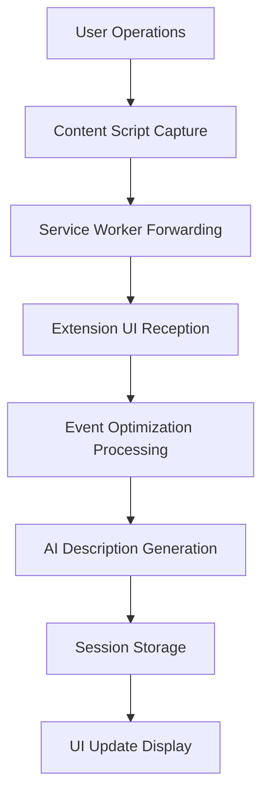

# Chrome Extension Record System Documentation

## Overview

The Chrome Extension Record System is a sophisticated event recording and playback system that implements automated browser operation recording through the following core functionalities:

- **Event Capture**: Records user interactions in the browser including clicks, inputs, scrolls, navigation, etc.
- **AI Enhancement**: Uses AI to generate element descriptions, improving event readability and comprehensibility
- **Session Management**: Supports creation, management, and switching of multiple recording sessions
- **Event Optimization**: Optimizes recorded events through caching, deduplication, and intelligent description generation

## System Architecture

### Core Components

```
Record System
├── UI Layer
│   ├── Record (Main Component)
│   ├── RecordList (Session List)
│   ├── RecordDetail (Session Details)
│   └── SessionModals (Session Modals)
├── Hook Layer (Logic Layer)
│   ├── useRecordingControl (Recording Control)
│   ├── useRecordingSession (Session Management)
│   ├── useTabMonitoring (Tab Monitoring)
│   └── useLifecycleCleanup (Lifecycle Cleanup)
├── Service Layer
│   ├── eventOptimizer (Event Optimization)
│   ├── Chrome APIs (Browser APIs)
│   └── Content Scripts
└── Storage Layer
    ├── RecordStore (Recording State)
    └── RecordingSessionStore (Session Storage)
```

### Data Flow



## Core Functional Modules

### 1. Recording Control (useRecordingControl)

**File Location**: `src/extension/record/hooks/useRecordingControl.ts`

**Main Functions**:
- Start/stop recording
- Event reception and processing
- Tab monitoring and automatic stopping
- Script injection management

**Key Methods**:
```typescript
// Start recording
const startRecording = useCallback(async () => {
  // 1. Check environment and current session
  // 2. Inject recording script
  // 3. Clean up previous recording instances
  // 4. Send start message to content script
  // 5. Update recording state
})

// Stop recording
const stopRecording = useCallback(async () => {
  // 1. Send stop message to content script
  // 2. Generate AI title and description
  // 3. Update session state and events
  // 4. Clean up recording state
})
```

### 2. Session Management (useRecordingSession)

**File Location**: `src/extension/record/hooks/useRecordingSession.ts`

**Main Functions**:
- Session creation, updating, deletion
- Session selection and switching
- Event export

**Data Structure**:
```typescript
interface RecordingSession {
  id: string;
  name: string;
  description?: string;
  createdAt: number;
  updatedAt: number;
  events: ChromeRecordedEvent[];
  status: 'idle' | 'recording' | 'completed';
  url?: string;
}
```

### 3. Event Optimization (eventOptimizer)

**File Location**: `src/utils/eventOptimizer.ts`

**Main Functions**:
- Event processing and optimization
- AI description generation (with deduplication and caching)
- Element screenshot generation
- Debouncing mechanism

**Optimization Strategies**:
```typescript
// Caching strategy
const descriptionCache = new Map<string, string>(); // Description cache
const boxedScreenshotCache = new Map<string, string>(); // Screenshot cache

// Debouncing mechanism
const DEBOUNCE_DELAY = 1000; // 1 second debounce delay
const debounceTimeouts = new Map<string, NodeJS.Timeout>();

// Deduplication strategy
const ongoingDescriptionRequests = new Map<string, Promise<string>>();
```

## Event Recording Flow

### 1. Recording Startup Flow

```
1. User clicks start recording
2. Check current tab and environment
3. Create or select recording session
4. Inject content scripts (record-iife.js + event-recorder-bridge.js)
5. Send start recording message to content script
6. Establish Service Worker connection to listen for events
7. Update UI state to recording
```

### 2. Event Capture and Processing Flow

```
1. User performs operations on page (clicks, inputs, etc.)
2. Content Script captures DOM events
3. Extract event information (type, coordinates, element info, etc.)
4. Forward to Extension through Service Worker
5. Extension receives events and performs optimization processing:
   - Generate cache key
   - Check existing cache
   - Generate marked screenshots
   - Call AI to generate element descriptions (debounced processing)
6. Update session event list
7. Real-time UI updates
```

### 3. Recording Stop Flow

```
1. User clicks stop recording or page refresh triggers
2. Send stop message to content script
3. Collect final event list
4. Generate AI title and description (based on event summary)
5. Update session status to completed
6. Clean up recording state and listeners
7. Display recording completion feedback
```

## AI Enhancement Features

### 1. Element Description Generation

**Implementation Location**: `eventOptimizer.ts:generateAIDescription()`

**Processing Strategy**:
- **Cache First**: Check if description cache exists for the same element
- **Deduplication Mechanism**: Avoid generating descriptions for the same element repeatedly
- **Debounced Processing**: Only execute the last request within 1 second for multiple requests
- **Fallback Processing**: Use basic descriptions as backup when AI fails

**Cache Key Generation**:
```typescript
const generateElementCacheKey = (event: RecordedEvent): string => {
  if (event.elementRect) {
    const rect = event.elementRect;
    return `${rect.left || rect.x || 0}-${rect.top || rect.y || 0}-${rect.width || 0}-${rect.height || 0}`;
  }
  return event.timestamp.toString();
};
```

### 2. Recording Title Generation

**Implementation Location**: `utils.ts:generateRecordTitle()`

**Generation Strategy**:
- Extract page title, URL, operation type statistics
- Prioritize using navigation and click event screenshots
- Generate concise titles and descriptions based on event summaries
- Use timestamps as backup when LLM fails

## Performance Optimization

### 1. Caching Mechanism

```typescript
// LRU cache implementation
const MAX_CACHE_SIZE = 100;
const addToCache = (cache: Map<string, string>, key: string, value: string) => {
  // Remove least recently used items
  if (cache.size >= MAX_CACHE_SIZE && cacheKeyOrder.length > 0) {
    const oldestKey = cacheKeyOrder.shift();
    if (oldestKey) {
      descriptionCache.delete(oldestKey);
      boxedScreenshotCache.delete(oldestKey);
    }
  }
  cache.set(key, value);
  cacheKeyOrder.push(key);
};
```

### 2. Debouncing Mechanism

```typescript
// Debouncing implementation to avoid frequent AI calls
const debouncedGenerateAIDescription = (
  event: RecordedEvent,
  imageBase64: string,
  cacheKey: string,
  updateCallback?: (description: string) => void,
): Promise<string> => {
  return new Promise((resolve, reject) => {
    const existingTimeout = debounceTimeouts.get(cacheKey);
    if (existingTimeout) {
      clearTimeout(existingTimeout);
    }
    
    const timeout = setTimeout(() => {
      debounceTimeouts.delete(cacheKey);
      generateAIDescriptionInternal(event, imageBase64, cacheKey, updateCallback)
        .then(resolve)
        .catch(reject);
    }, DEBOUNCE_DELAY);
    
    debounceTimeouts.set(cacheKey, timeout);
  });
};
```

### 3. Asynchronous Processing

- **Event Processing**: Use asynchronous processing to avoid blocking UI
- **AI Calls**: Background processing with UI showing loading state
- **Batch Updates**: Support batch event processing and updates

## State Management

### 1. RecordStore (Recording State)

```typescript
interface RecordStore {
  isRecording: boolean;
  events: ChromeRecordedEvent[];
  // Actions
  setIsRecording: (recording: boolean) => void;
  addEvent: (event: ChromeRecordedEvent) => void;
  updateEvent: (event: ChromeRecordedEvent) => void;
  clearEvents: () => void;
  setEvents: (events: ChromeRecordedEvent[]) => void;
}
```

### 2. RecordingSessionStore (Session Storage)

```typescript
interface RecordingSessionStore {
  sessions: RecordingSession[];
  currentSessionId: string | null;
  // Actions
  addSession: (session: RecordingSession) => void;
  updateSession: (id: string, updates: Partial<RecordingSession>) => void;
  deleteSession: (id: string) => void;
  setCurrentSession: (id: string | null) => void;
  getCurrentSession: () => RecordingSession | null;
}
```

## Error Handling and Fault Tolerance

### 1. Script Injection Failure Handling

- Detect Chrome internal pages and provide error prompts
- Provide retry mechanism
- Graceful degradation to manual injection

### 2. AI Service Failure Handling

- Use fallback description strategy
- Cache failure results to avoid repeated requests
- User-friendly error prompts

### 3. Page Refresh Handling

- Automatically detect page state changes
- Promptly stop recording and save data
- Clean up related listeners and state

## Security Considerations

### 1. Permission Control

- Only run in extension environment
- Check tab permissions
- Secure message passing mechanism

### 2. Data Protection

- Store sensitive data locally
- Secure handling of screenshot data
- User privacy protection

## Extension and Maintenance

### 1. Adding New Event Types

```typescript
// Add new event handling logic in eventOptimizer.ts
const generateFallbackDescription = (event: RecordedEvent): string => {
  switch (event.type) {
    case 'newEventType':
      return `New event type handling`;
    // ... other cases
  }
};
```

### 2. Optimizing AI Description Generation

- Adjust debounce delay time
- Optimize caching strategy
- Improve prompt templates

### 3. Performance Monitoring

- Add performance metrics for critical paths
- Monitor memory usage
- Optimize processing efficiency for large numbers of events

## Common Issues and Solutions

### 1. Recording Cannot Start

**Possible Causes**:
- Current page does not support script injection (Chrome internal pages)
- Insufficient extension permissions
- Content script injection failure

**Solutions**:
- Switch to regular web pages for recording
- Check extension permission settings
- Retry after reloading the page

### 2. Event Description Generation Failure

**Possible Causes**:
- AI service unavailable
- Network connection issues
- API key configuration error

**Solutions**:
- System will automatically use fallback descriptions
- Check network connection and API configuration
- View console error logs

### 3. Recording Performance Issues

**Possible Causes**:
- Event frequency too high
- High cache miss rate
- Too frequent AI calls

**Solutions**:
- Increase debounce delay time
- Optimize caching strategy
- Reduce unnecessary AI calls

## Summary

The Chrome Extension Record System is a comprehensive browser operation recording system that provides users with powerful browser automation recording capabilities through reasonable architectural design, effective performance optimization, and friendly user experience. The core advantages of the system include:

- **Intelligence**: AI-enhanced event descriptions and title generation
- **High Performance**: Comprehensive caching and debouncing mechanisms
- **Fault Tolerance**: Multi-level error handling and fallback strategies
- **Extensibility**: Modular architectural design facilitates feature expansion
- **User-Friendly**: Intuitive UI and timely feedback mechanisms