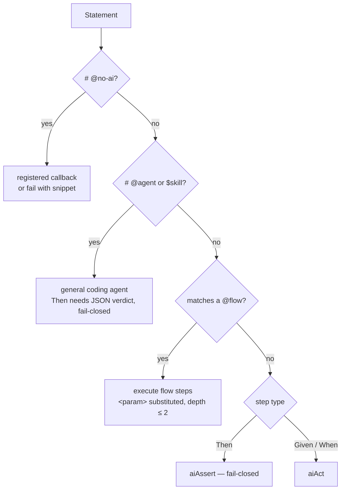

# @midscene/bdd

AI-native BDD: standard Gherkin, executed by AI instead of step-definition code.

## What is this

`@midscene/bdd` runs ordinary Gherkin feature files through cucumber-js, but instead of requiring you to implement a step definition for every line, each statement is executed by [Midscene](https://midscenejs.com)'s vision agent. Given/When steps are performed against the live page via `aiAct`; Then steps are judged via `aiAssert`, which is fail-closed — if the model cannot confirm the assertion, the step fails. You write the behavior; the agent does the driving. Classic callbacks and a general-purpose coding agent remain available as per-statement opt-ins.

```gherkin
Feature: Cart inspection

  Scenario: Cart shows quantity controls and the correct total
    Given I am logged in as "guest"
    And I have added "Camp Mug" to the cart
    When I open the cart page
    Then the cart line item shows quantity controls to increase and decrease the quantity
    And the cart total equals the Camp Mug unit price of $24.50
```

No step definitions exist for this scenario. The first two lines call reusable Gherkin-authored flows (see below); every other line is performed or verified by the vision agent directly.

## The three routing rules

Every statement is routed to exactly one executor:

| Rule | Marker | Who executes the statement |
| --- | --- | --- |
| **Default** | none | Midscene UI agent — the vision model drives the page (`aiAct`) for Given/When and judges Then steps (`aiAssert`, fail-closed) |
| **Agent** | `# @agent` comment directly above the line, or a `$skill-name` token in it | A general-purpose coding agent (Codex app-server via `codex login`, or any OpenAI-compatible endpoint) — for behavior you cannot see in the browser: server logs, files, databases. Then steps must return a JSON verdict; a missing verdict fails (fail-closed) |
| **No AI** | `# @no-ai` comment above the line (or `@no-ai` scenario/feature tag) | Classic BDD: a callback registered with `Given`/`When`/`Then`/`defineStep` from `@midscene/bdd` must match. An unimplemented step fails with a ready-to-paste snippet |

All three in one scenario:

```gherkin
Feature: Failed login reporting

  Scenario: Failed login is reported everywhere
    Given I open the login page of the demo shop
    When I try to sign in as the "admin" user with a wrong password
    Then an error toast shows on the screen
    # @agent
    Then the server log contains a failed-login warning, per $check-logs
    # @no-ai
    Then the login attempt counter increments
```

The first three lines run through Midscene against the page. The fourth bails out to the coding agent, loading the `check-logs` skill into its prompt. The last requires a registered callback:

```js
// features/step_definitions/counters.steps.js
const { defineStep } = require('@midscene/bdd');

defineStep('the login attempt counter increments', async () => {
  // deterministic check — no AI involved; throw to fail the step
});
```

If no callback matches a `@no-ai` step, the run fails with a `defineStep(...)` snippet generated from the step text (quoted values become `{string}` parameters), ready to paste.

## Reusable flows: step definitions authored in Gherkin

A flow is a scenario tagged `@flow` whose **name is a cucumber expression**. Any other scenario can then call it as a plain step:

```gherkin
# features/flows/login.feature
Feature: Shared login flow

  @flow @param:role
  Scenario: I am logged in as {string}
    When I open the login page
    And I sign in as the "<role>" user with the demo password shown on the login form
    Then the dashboard for the "<role>" role is visible
```

```gherkin
# any other feature file
Given I am logged in as "admin"
```

- `@param:role` binds the expression's `{string}` capture to the `<role>` placeholder inside the flow body — the same `<x>` substitution semantics as a Scenario Outline, scoped to the flow. Multiple `@param:` tags bind captures positionally, in tag order. A capture/param count mismatch is an error, and so is a `<placeholder>` in the flow body that names no declared param.
- Flows may call other flows, capped at depth 2.
- Flows are discovered across all files matched by the features glob — define once, call from any feature.
- The base cucumber profile excludes `@flow` scenarios from standalone runs (`tags: 'not @flow'`); they only execute when called.
- Two flows matching the same step text is an ambiguity error listing both definitions, mirroring cucumber's ambiguous-step behavior.

There is also a literal sugar form, useful when the flow name would read awkwardly inline:

```gherkin
Given I run the "I am logged in as {string}" flow with role "admin"
```

Arguments are `name "value"` pairs; unknown or missing argument names are errors.

## Skills

Skills are markdown instruction files for the general agent, discovered in the skills directory (default `features/skills`):

```
features/skills/check-logs.md        # flat layout
features/skills/check-logs/SKILL.md  # folder layout
```

Referencing `$check-logs` in a step (or in its annotation comment) routes the statement to the general agent and appends the markdown content to its prompt. Referencing a skill that does not exist fails with the list of available skill names; the same name in both layouts is an error.

## Quick start

Folder layout:

```
midscene.config.ts
cucumber.js
features/
  *.feature
  step_definitions/   # classic callbacks for @no-ai steps (optional)
  skills/             # markdown skills for $tokens (optional)
```

`midscene.config.ts`:

```ts
import { defineBddConfig } from '@midscene/bdd';

export default defineBddConfig({
  uiAgent: { type: 'web', url: 'http://localhost:3000' },
});
```

`cucumber.js` — the entire file is one line:

```js
module.exports = require('@midscene/bdd/profile').defineProfile();
```

In an ESM project (`"type": "module"` in `package.json`), use the import form instead:

```js
// cucumber.js (or cucumber.mjs)
import { defineProfile } from '@midscene/bdd/profile';

export default defineProfile().default;
```

Model setup, either:

- `codex login` once, then point the general agent at it with `MIDSCENE_MODEL_BASE_URL=codex://app-server`, or
- set the `MIDSCENE_MODEL_*` environment variables for any OpenAI-compatible endpoint (at minimum `MIDSCENE_MODEL_BASE_URL`, `MIDSCENE_MODEL_API_KEY`, `MIDSCENE_MODEL_NAME`).

Run:

```bash
npx cucumber-js     # uses cucumber.js -> the @midscene/bdd profile
# or
npx midscene-bdd    # zero-config launcher; injects the same preset when no cucumber config exists
```

A runnable end-to-end demo (static shop page, all three routing rules, flows, skills) lives in [`example/`](./example/README.md).

## Dashboard explorer

`midscene-bdd dashboard` renders a self-contained HTML explorer from the
`ExploreModel` payload. The UI itself lives in the React app at
`apps/bdd-dashboard`; its built `index.html` is mirrored into
`packages/bdd/static/dashboard-template.html` and filled at runtime.

For source checkouts, build that app before generating dashboards:

```bash
npx nx build bdd-dashboard
```

## Gherkin tour

New to Cucumber/BDD? [`example/features/gherkin-tour/`](./example/features/gherkin-tour/) walks through the full standard [Gherkin grammar](https://cucumber.io/docs/gherkin/reference/) as runnable, commented feature files — proof that every construct works unchanged through this framework:

| File | Constructs |
| --- | --- |
| `01-steps-and-comments.feature` | Feature description blocks, `Given`/`When`/`Then`/`And`/`But`, the `*` bullet keyword, `#` comments (and this framework's marker-comment extension) |
| `02-background-and-rules.feature` | Feature-level `Background:`, `Rule:` grouping with its own Background and tag, the `Example:`/`Scenario:` synonyms (and how `Example:` differs from `Examples:`) |
| `03-scenario-outlines.feature` | `Scenario Outline:` / `Scenario Template:`, `<placeholder>` substitution in step text, the outline name, data table cells, and doc strings; multiple named `Examples:`/`Scenarios:` tables, tagged Examples |
| `04-data-tables-and-doc-strings.feature` | Data tables on a step; doc strings with `"""` fences, a content type, and the ``` backtick alternative |
| `05-localized-keywords.feature` | The `# language:` header (German keywords driving the same English prompts) |

## Configuration reference

`defineBddConfig` validates eagerly, so config mistakes fail at definition time.

```ts
interface BddConfig {
  // Declarative platform target (see the table below) — or a factory for
  // anything else: () => Promise<{ agent: UiAgent; cleanup?: () => Promise<void> }>
  uiAgent: UiTarget | UiAgentFactory;

  // Agent construction options shared by every target type — mirrors the
  // yaml `agent:` block: generateReport (default: true), reportFileName,
  // groupName, groupDescription, cache, replanningCycleLimit, ...
  uiAgentOptions?: UiAgentOptions;

  generalAgent?: {
    // MIDSCENE_MODEL_* overrides for the general agent, resolved in an
    // isolated model config (never leaks into the UI agent). Defaults to
    // process env; MIDSCENE_MODEL_BASE_URL=codex://app-server is supported.
    modelEnv?: Record<string, string>;
    // Escape hatch mirroring the uiAgent factory (e.g. for tests).
    factory?: () => Promise<GeneralAgent>;
  };

  paths?: {
    // Feature globs, relative to the config dir. Used for flow discovery.
    features?: string[];          // default: ['features/**/*.feature']
    skills?: string;              // default: 'features/skills'
  };
}
```

`uiAgent` is a flat union discriminated on `type` — field names match the corresponding [yaml automation](https://midscenejs.com/automate-with-scripts-in-yaml) env blocks, so configs translate 1:1:

| `type` | Fields | Notes |
| --- | --- | --- |
| `'web'` | `url` (required), `headed?`, `viewportWidth?`, `viewportHeight?`, `userAgent?` | Built-in puppeteer launcher |
| `'android'` | `deviceId?`, `launch?`, plus `AndroidDeviceOpt` passthrough (`androidAdbPath?`, `remoteAdbHost?`, ...) | Needs `@midscene/android` |
| `'ios'` | `deviceId?`, `launch?`, plus `IOSDeviceOpt` passthrough (`wdaPort?`, `wdaHost?`, ...) | Needs `@midscene/ios` |
| `'harmony'` | `deviceId?`, `launch?`, plus `HarmonyDeviceOpt` passthrough (`hdcPath?`, ...) | Needs `@midscene/harmony` |
| `'computer'` | `displayId?` | Needs `@midscene/computer` |
| `'interface'` | `module` (required), `export?`, `param?` | Any custom `AbstractInterface` device class; relative `module` paths resolve against the config file's directory |

Every target also accepts `scope?: 'scenario' | 'worker'`:

- `'scenario'` (default) — a fresh agent per scenario: full isolation, one Midscene report per scenario. Cheap for browsers.
- `'worker'` — one agent per cucumber worker, reused across scenarios and destroyed when the worker finishes. Use this for device targets where reconnecting per scenario is expensive. Note the report semantics differ: scenarios share one rolling Midscene report (the same path is attached to each scenario) instead of one report per scenario. Factory configs are always scenario-scoped.

The android/ios/harmony/computer platform packages are **optional peer dependencies** — install the one your target needs, e.g.:

```bash
pnpm add -D @midscene/android   # for uiAgent: { type: 'android', ... }
```

The config file is loaded from `midscene.config.ts` in the working directory (TypeScript works at runtime, via jiti); override the location with the `MIDSCENE_BDD_CONFIG` environment variable.

`defineProfile(overrides?)` merges overrides onto the base cucumber profile: `import` and `format` are concatenated and deduped, `paths` replaces, `tags` combines as `(not @flow) and (<yours>)` so flow scenarios never run standalone, and any other keys are spread on top.

## Conventions

Everything cucumber gives you keeps working — this package adds exactly three extensions:

| | Mechanism | Prior art / rationale |
| --- | --- | --- |
| **100% standard** | `Background`, `Scenario Outline` + `Examples`, `Rule`, tags, data tables, doc strings, hooks, formatters, parallel workers, tag expressions, `cucumber.js` profiles | Plain cucumber-js — this package is one catch-all step definition plus a config preset |
| **Extension 1** | `# @agent` / `# @no-ai` / `# @soft` comment lines directly above a step | Gherkin has no step-level tags, so per-step routing lives in comment annotations (the established workaround in the Gherkin ecosystem) |
| **Extension 2** | `$skill-name` tokens in step text | Shell-style `$` references; a token both routes the statement to the general agent and loads the skill |
| **Extension 3** | `@flow` / `@param:x` scenario tags | Karate's `call` model for reusable sub-scenarios, expressed through standard Gherkin tags; `<param>` substitution inside the flow body mirrors Scenario Outline placeholders |

Data tables and doc strings on AI-routed steps are appended to the prompt verbatim. `@no-ai` and `@soft` may also be applied as ordinary scenario/feature tags (inherited per normal Gherkin semantics); `@agent` is deliberately per-line only.

Callback registration is the cucumber shape — `Given`/`When`/`Then` take `(pattern, fn)` where `pattern` is a cucumber expression string or a RegExp, and captures arrive as function arguments. Per cucumber convention the keyword is documentation only: matching ignores it, and `defineStep` is the keyword-agnostic alias. Two deliberate divergences from standard cucumber:

- **`this` is the step context, not the cucumber World.** Use a regular `function` (not an arrow) to access it: `this.getUiAgent()` / `this.peekUiAgent()`, `this.attach(...)`, `this.log(...)`, plus the step's `stepText`, `annotations`, `dataTable`, and `docString`.
- **Data tables and doc strings are not passed as a trailing argument.** Standard cucumber appends the `DataTable`/doc-string as the last callback parameter; here the callback receives only the pattern captures — read the step's table or doc string via `this.dataTable` (rendered `| cell |` lines) and `this.docString` instead.

## How it works

cucumber-js drives the run; `@midscene/bdd/register` contributes a single catch-all step definition that routes every statement, in strict precedence order:



- **Soft checks:** `# @soft` above a Then step (or a `@soft` tag) downgrades an assertion failure to a logged warning attached to the report — the step never fails. There is no native cucumber "soft" status, so the scenario stays green by design.
- **Outlines:** a Scenario Outline's pickle steps point at the outline's step node, so an annotation comment above an outline step applies to every Examples row.
- **Laziness:** the browser launches only when the first UI-routed step runs, and the general agent connects only on the first `@agent`/`$skill` step. The general agent receives the current page screenshot only if a UI session already exists — it never launches a browser.

## Status

Experimental, private package — not yet published to npm, APIs may change without notice. Design lineage: the proof of concept in [PR #2639](https://github.com/web-infra-dev/midscene/pull/2639).
